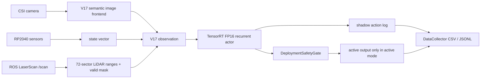

# DonkeyCar RL Racing

This repository contains simulator training code and Jetson endpoint deployment
work for DonkeyCar-style autonomous racing experiments. The strongest, most
complete engineering artifact in this branch is the V17 Jetson endpoint
deployment pipeline.

## V17 Endpoint Deployment Summary

The V17 deployment work proves that a recurrent, multi-modal policy can be
exported from PyTorch/SB3 to ONNX, compiled to a TensorRT FP16 actor engine, and
run on a Jetson with reproducible shadow-mode evidence, safety preflight checks,
runtime monitoring, and deployment logs.

Supported conclusion:

> V17 is deployed on Jetson as an observable, reproducible, safety-gated
> endpoint inference pipeline using ONNX/TensorRT, LiDAR sectorization,
> asynchronous logging, and shadow-mode validation.

Not supported by this repository:

> V17 has proven obstacle-avoidance quality, active closed-loop driving quality,
> or full-track completion.

The active vehicle behavior was intentionally separated from deployment
validation because observed active driving quality is limited by model training
and policy quality, not by the endpoint deployment evidence.

## Architecture



In `shadow` mode, V17 output is logged but does not control the actuator. The
P1 evidence adds explicit CSV fields:

- `actual_actuator_source=user/manual`
- `v17_output_route=shadow_only`
- `shadow_non_takeover=true`

## Key Engineering Work

- Actor-only ONNX export for V17 recurrent policy.
- TensorRT FP16 engine build and CUDA runtime-backed inference.
- Continuous LSTM state handling through TensorRT `h/c -> next_h/next_c`.
- Engine and metadata preflight fail-fast checks.
- Metadata mismatch negative tests for bad LiDAR dimension, LSTM hidden size,
  and missing input/output names.
- 360-degree LiDAR scan sectorization into 72 range sectors plus 72 valid flags.
- DataCollector asynchronous CSV/JSONL writer.
- Async writer queue depth, dropped-record, written-record, backlog, and RSS
  metrics.
- Runtime safety gate for LiDAR, RP2040, and inference timeout conditions.
- Shadow A/B and final 20-minute TensorRT shadow validation.
- Reproducibility manifest with code/model/ONNX/engine/metadata hashes.

## Evidence Snapshot

Final 20-minute TensorRT shadow run:

| Metric | Result |
|---|---:|
| duration | 1199.55 s |
| exit code | 0 |
| frames logged | 1985 |
| V17 latency p50 | 237.113 ms |
| V17 latency p95 | 281.205 ms |
| V17 latency p99 | 303.734 ms |
| loop dt p95 | 286.900 ms |
| LiDAR scan age p95 | 351.220 ms |
| DataCollector p99 | 9.870 ms |
| safety blocked | false |

Optimized PyTorch vs TensorRT A/B:

| Metric | PyTorch | TensorRT | Change |
|---|---:|---:|---:|
| actor residual p50 | 25.856 ms | 12.479 ms | -51.74% |
| actor residual p95 | 40.988 ms | 17.046 ms | -58.41% |
| full V17 latency mean | 229.556 ms | 199.060 ms | -13.28% |
| effective FPS mean | 4.199 | 4.867 | +15.91% |
| loop dt p95 | 277.315 ms | 265.920 ms | -4.11% |

P0/P1 hardening evidence:

| Evidence | Result |
|---|---|
| 1000-sample continuous LSTM replay diff | pass, action max abs diff `0.004552633` |
| Runtime LiDAR freeze/drop shadow injection | stale counters increase, shadow does not block actuator |
| Active safety gate mock | stale/timeout outputs `angle=0`, `throttle=0`, `vehicle.on=false` |
| Async writer P1 shadow run | queue max `1`, backlog final `0`, dropped records `0` |
| Shadow non-takeover CSV | 301/301 rows pass |
| Metadata mismatch negative tests | all fail-fast before vehicle loop |

## Why End-to-End P95 Is Still High

TensorRT accelerates the actor backend, not the entire DonkeyCar loop. The final
20-minute waterfall shows that full-runtime p95 is still shaped by:

- vision/semantic preprocessing,
- LiDAR scan age,
- camera and Python vehicle-loop jitter,
- runtime system scheduling.

This is why actor residual improves by more than 50% while full-loop p95 does
not improve by the same factor.

## Important Files

Runtime:

- `Jetson/runtime_monitor.py`
- `Jetson/v17_pilot.py`
- `Jetson/v17_trt_runtime.py`
- `Jetson/summarize_shadow_run.py`

Jetson runtime tool copies:

- `tools/v17_trt_runtime.py`
- `tools/summarize_shadow_run.py`

Deployment tools:

- `tools/export_v17_actor_onnx.py`
- `tools/check_v17_trt_runtime.py`
- `tools/compare_v17_torch_trt.py`
- `tools/replay_v17_torch_trt_diff.py`
- `tools/summarize_v17_latency_waterfall.py`
- `tools/check_v17_preflight_negative_cases.py`
- `tools/check_deployment_safety_gate_active_mock.py`
- `tools/write_v17_repro_manifest.py`
- `tools/run_v17_10min_post_gate.sh`
- `tools/run_v17_20min_final_shadow.sh`

Primary reports:

- `docs/v17_endpoint_deployment_final_frozen_report_2026-05-25.md`
- `docs/v17_endpoint_deployment_complete_record_2026-05-25.md`
- `docs/v17_endpoint_deployment_p0_hardening_result_2026-05-25.md`
- `docs/v17_endpoint_deployment_p1_evidence_result_2026-05-25.md`
- `docs/v17_endpoint_deployment_validation_result_2026-05-24.md`
- `docs/v17_vision_frontend_separate_analysis_2026-05-24.md`

## Reproducing The Main Jetson Runs

The Jetson deployment environment used for validation:

- Jetson L4T R32.5.2 / Ubuntu 18.04.6
- CUDA 10.2
- TensorRT 7.1.3.0
- Python environment: `/home/jetson/env`
- Project path: `/home/jetson/mycar`
- Required OpenMP workaround:

```bash
export LD_PRELOAD=/usr/lib/aarch64-linux-gnu/libgomp.so.1
```

Final TensorRT shadow runner:

```bash
cd /home/jetson/mycar
. /home/jetson/env/bin/activate
tools/run_v17_20min_final_shadow.sh
```

P1 preflight mismatch checks:

```bash
python tools/check_v17_preflight_negative_cases.py \
  --runtime-monitor /home/jetson/mycar/runtime_monitor.py \
  --cwd /home/jetson/mycar \
  --model /home/jetson/mycar/models/v17_postpass_hard_gate_final_model.zip \
  --engine /home/jetson/mycar/models/v17_actor_fp16.engine \
  --metadata /home/jetson/mycar/models/v17_actor_export.json \
  --out-dir /home/jetson/mycar/monitor_logs/v17_p1_evidence/preflight_negative_cases
```

## Repository Policy

Tracked in Git:

- source code,
- Jetson runtime scripts,
- deployment tools,
- reports and experiment summaries,
- reproducibility scripts.

Not tracked in Git:

- raw `monitor_logs/`,
- trained models,
- ONNX files,
- TensorRT engines,
- DonkeyCar tubs/data,
- local environment files.

Large artifacts are intentionally kept outside the repository. For the V17
deployment snapshot, local backups include model artifacts, full V17 monitor
logs, and a `/home/jetson/mycar` scripts/docs archive.
