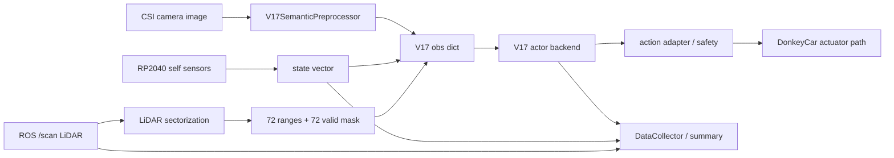

# V17 端侧部署完整记录

日期：2026-05-25
Git 分支：`codex/v17-endpoint-deployment`
Jetson：`jetson@192.168.1.176`
项目目录：`/home/jetson/mycar`
最终冻结报告：`docs/v17_endpoint_deployment_final_frozen_report_2026-05-25.md`

## 1. 总结论

V17 端侧部署工程链路已经完成并冻结。当前结论只覆盖 Jetson 端侧部署能力，不覆盖模型策略效果。

可以成立的交付结论：

> V17 已在 Jetson 上完成 ONNX/TensorRT actor 部署、CUDA runtime 推理、LiDAR sectorization、DataCollector 异步化、telemetry cache、安全 preflight/gate、shadow A/B、长稳 shadow 复现和可追溯日志归档。端侧部署链路已经具备稳定、可复现、可观测、可安全阻断的工程证据。

不能写成：

> V17 已具备实车避障能力，或者 active closed-loop 已通过。

原因：

- active 实车效果已知会乱跑，主要归因于模型训练/策略质量不足。
- 本轮不验证避障成功率、不验证跑圈、不用 active 乱跑评价部署链路。
- 端侧部署验收指标是稳定性、延迟、可复现、日志、shadow 不接管、安全阻断。

## 2. 端侧部署边界

### 2.1 本轮算作部署成果的内容

- PyTorch/SB3 V17 actor 到 ONNX 的导出。
- TensorRT FP16 engine 构建。
- TensorRT runtime 封装和 CUDA runtime API 调用。
- V17Pilot 接入 TensorRT actor。
- `runtime_monitor.py` 支持 TensorRT shadow backend。
- LiDAR 360 度 scan sectorization 前移。
- DataCollector CSV 和 LiDAR raw JSONL 异步写入。
- Jetson telemetry 后台缓存。
- Engine/metadata preflight fail-fast。
- Active 前 safety gate 参数和 runtime safety monitor。
- `runtime_monitor.py --serial-port` 与 `cfg.RP2040_SERIAL_PORT` 统一。
- Summary 和 aggregate report 生成工具。
- 180s、10min、20min TensorRT shadow 复现实验。
- 故障注入：engine missing、metadata missing、RP2040 missing、LiDAR disabled、LiDAR stale、inference timeout counter。

### 2.2 本轮不算作部署成果的内容

- 模型是否会避障。
- 模型是否能稳定跑完整赛道。
- active closed-loop 控制效果。
- 训练奖励、训练数据分布、策略泛化。
- 视觉语义前处理重写或 GPU 化。

视觉前端仍然是剩余瓶颈之一，但本轮只是将它拆分出来做边界说明，没有宣称已经优化。独立文档见：

`docs/v17_vision_frontend_separate_analysis_2026-05-24.md`

## 3. Jetson 环境

| 项目 | 记录 |
|---|---|
| 主机 | `nano-4gb-jp451` |
| Jetson IP | `192.168.1.176` |
| 系统 | Jetson L4T R32.5.2 / Ubuntu 18.04.6 |
| CUDA | 10.2 |
| TensorRT | 7.1.3.0 |
| Python env | `/home/jetson/env` |
| 项目目录 | `/home/jetson/mycar` |
| 运行前置 | `. /home/jetson/env/bin/activate` |
| OpenMP workaround | `LD_PRELOAD=/usr/lib/aarch64-linux-gnu/libgomp.so.1` |

ONNX Runtime 在当前 venv 中未安装，但当前部署不依赖 ONNX Runtime。ONNX 在本项目中是 PyTorch actor 到 TensorRT engine 的中间格式，实际加速由 TensorRT engine 和 CUDA runtime 执行。

## 4. 模型与输入输出

部署模型：

`/home/jetson/mycar/models/v17_postpass_hard_gate_final_model.zip`

V17 不是普通 CNN，它是 `RecurrentPPO + LiDARFiLMFeatureExtractor` 风格的 actor。部署只需要 deterministic actor path，不需要 critic、optimizer 或训练封装。

真实输入输出：

| 名称 | 形状 | 说明 |
|---|---|---|
| `image` | `(1, 6, 128, 128)` | 6 通道 semantic image |
| `state` | `(1, 7)` | 自车状态 |
| `lidar` | `(1, 144)` | 72 sector range + 72 valid mask |
| `lidar_meta` | `(1, 2)` | LiDAR meta |
| `h` | `(2, 1, 256)` | LSTM hidden state |
| `c` | `(2, 1, 256)` | LSTM cell state |
| `action` | `(1, 3)` | actor 输出 |
| `next_h` | `(2, 1, 256)` | 下一步 hidden state |
| `next_c` | `(2, 1, 256)` | 下一步 cell state |

关键点：

- 当前部署使用 `lidar_dim=144`，不是 72 或 36。
- `lidar=144` 表示 72 个 sector range 加 72 个 valid mask。
- 当前推理使用 360 度 LiDAR，不是 180 度。
- 已有 shadow CSV 记录 `angle_min=-3.141593`、`angle_max=3.141593`，span 约 360 度，`points_total` 约 1147。
- LSTM `h/c` 必须由 TensorRT runtime 持续维护，reset 时机不能随意丢。

## 5. Runtime 数据流



shadow 模式下，`V17Pilot` 只产生 shadow 输出并记录日志，actuator path 保持 user/manual，不接管车辆。

active 模式下，安全 gate 默认启用 `require_lidar`、`require_rp2040`、`max_lidar_age_ms`、`max_rp2040_age_ms`、`max_inference_ms`。本轮没有用 active 做模型效果验收。

## 6. 代码交付物

### 6.1 Jetson runtime

| 文件 | 作用 |
|---|---|
| `Jetson/runtime_monitor.py` | 主 runtime monitor、LiDAR reader、DataCollector、safety preflight/gate、shadow/active 参数 |
| `Jetson/v17_pilot.py` | V17Pilot、semantic preprocess、PyTorch/TensorRT actor backend 接入 |
| `Jetson/v17_trt_runtime.py` | TensorRT actor runtime，使用 `ctypes + libcudart` 管理 CUDA memory/stream |
| `Jetson/summarize_shadow_run.py` | 从 CSV 生成 summary JSON 和日志副本 |

### 6.2 Tools

| 文件 | 作用 |
|---|---|
| `tools/export_v17_actor_onnx.py` | 导出 actor-only ONNX 和 metadata |
| `tools/check_v17_trt_runtime.py` | TensorRT runtime smoke test |
| `tools/compare_v17_torch_trt.py` | PyTorch actor vs TensorRT actor action diff |
| `tools/aggregate_endpoint_validation.py` | 汇总多 run 矩阵，生成 aggregate JSON/Markdown |
| `tools/publish_stale_lidar_scan.py` | 发布固定旧 timestamp 的 `/stale_scan`，验证 LiDAR stale gate |
| `tools/run_v17_10min_post_gate.sh` | 10min TensorRT shadow post-gate 复现 runner |
| `tools/run_v17_20min_final_shadow.sh` | 20min TensorRT final shadow 复现 runner |

### 6.3 文档交付物

| 文件 | 内容 |
|---|---|
| `docs/v17_endpoint_deployment_final_frozen_report_2026-05-25.md` | 最终冻结结论 |
| `docs/v17_endpoint_deployment_validation_result_2026-05-24.md` | 180s/10min/safety matrix 初轮结果 |
| `docs/v17_p0_safety_gate_implementation_result_2026-05-24.md` | P0 safety gate 实现与复验 |
| `docs/v17_endpoint_deployment_p0_hardening_result_2026-05-25.md` | P0 证据补强：replay diff、waterfall、runtime stale/drop、manifest |
| `docs/v17_lidar_stale_pmic_validation_2026-05-24.md` | LiDAR stale 与 PMIC 100C 核查 |
| `docs/v17_lidar_sectorization_async_datacollector_2026-05-18.md` | LiDAR/DataCollector/telemetry 优化复盘 |
| `docs/v17_onnx_tensorrt_recap_2026-05-18.md` | ONNX/TensorRT 环境与早期性能复盘 |
| `docs/v17_optimized_backend_ab_2026-05-18.md` | 优化后 PyTorch vs TensorRT A/B |
| `docs/v17_runtime_bottleneck_analysis_2026-05-18.md` | runtime bottleneck 分析 |
| `docs/v17_vision_frontend_separate_analysis_2026-05-24.md` | 视觉前端独立分析 |
| `docs/v17_post_deployment_experiment_plan_2026-05-24.md` | 后续实验计划 |

## 7. ONNX 导出

ONNX 导出脚本：

`tools/export_v17_actor_onnx.py`

导出范围：

```text
image/state/lidar/lidar_meta + h/c -> action + next_h/next_c
```

未导出：

- critic/value head。
- SB3 训练 wrapper。
- optimizer。
- 训练用 distribution 逻辑。

这样做的原因是实时部署只需要 deterministic actor。导出 actor-only graph 可以降低部署复杂度，也减少 TensorRT 不必要的解析风险。

TensorRT 7 兼容处理：

- 使用固定 axis 的 LayerNorm 表达，规避动态 LayerNorm 导出风险。
- 避免 `chunk(dim=-1)` 这类 TensorRT 7 不友好的 ONNX 表达。
- 固定输入 shape，避免 runtime 动态 shape 管理复杂化。

生成文件：

| 文件 | 说明 |
|---|---|
| `/home/jetson/mycar/models/v17_actor.onnx` | actor ONNX graph |
| `/home/jetson/mycar/models/v17_actor_export.json` | 输入输出、opset、shape metadata |

metadata 关键字段：

```json
{
  "inputs": ["image", "state", "lidar", "lidar_meta", "h", "c"],
  "outputs": ["action", "next_h", "next_c"],
  "opset": 11,
  "shape": {
    "image_channels": 6,
    "obs_size": 128,
    "state_dim": 7,
    "lidar_dim": 144,
    "lidar_meta_dim": 2,
    "lstm_layers": 2,
    "lstm_hidden_size": 256
  }
}
```

## 8. TensorRT engine

Engine 文件：

`/home/jetson/mycar/models/v17_actor_fp16.engine`

构建方式：

- 使用 Jetson 自带 `/usr/src/tensorrt/bin/trtexec`。
- 从 `v17_actor.onnx` 构建 FP16 TensorRT engine。
- engine 与 Jetson Nano / CUDA 10.2 / TensorRT 7.1.3 强绑定，换设备或 JetPack 后建议重新 build。

model-only `trtexec --loadEngine` 结果：

| 指标 | 结果 |
|---|---:|
| GPU compute mean | 约 3.72 ms |
| Host latency mean | 约 3.98 ms |
| Throughput | 约 245.7 qps |

注意：这是 actor network 本体耗时，不包含 camera、semantic preprocess、LiDAR、DataCollector 或 DonkeyCar vehicle loop。

## 9. CUDA runtime 封装

TensorRT runtime 文件：

`Jetson/v17_trt_runtime.py`

当前没有安装 PyCUDA，也没有把 PyCUDA 作为性能优化依赖。原因：

- TensorRT engine 本身已经通过 CUDA kernel 执行。
- 当前 runtime 使用 `ctypes + libcudart` 管理 CUDA runtime API。
- 避免在 Jetson Nano 上编译 PyCUDA 的额外环境风险。

runtime 管理内容：

- TensorRT engine deserialize。
- Binding name 和 binding shape。
- `cudaMalloc` device buffer。
- `cudaMemcpyAsync` host/device copy。
- CUDA stream 创建、同步。
- `execute_async_v2`。
- persistent LSTM `h/c`。

当前真正影响端到端延迟的不是“有没有 PyCUDA”，而是 camera/semantic preprocess、LiDAR freshness、Python runtime contention 和 vehicle loop jitter。

## 10. 正确性验证

### 10.1 TensorRT runtime smoke

命令：

```bash
PYTHONPATH=/home/jetson/mycar/tools python tools/check_v17_trt_runtime.py
```

结果：通过。

输出 action 约为：

```text
[-0.029739 -0.249512 -0.026794]
```

### 10.2 PyTorch vs TensorRT action diff

命令：

```bash
PYTHONPATH=/home/jetson/mycar/tools python tools/compare_v17_torch_trt.py --tolerance 0.02
```

结果：通过。

| 项目 | 数值 |
|---|---:|
| PyTorch action | `[-0.029122, -0.249469, -0.026623]` |
| TensorRT action | `[-0.029739, -0.249512, -0.026794]` |
| max abs diff | `0.000617` |
| tolerance | `0.02` |

结论：TensorRT FP16 actor 与 PyTorch actor 输出误差远低于部署阈值。

## 11. TensorRT runtime 集成

`V17Pilot` 支持：

- PyTorch/manual SB3 actor backend。
- TensorRT FP16 actor backend。
- actor residual 拆分：`pilot_inference_latency_ms - pilot_preprocess_latency_ms`。

`runtime_monitor.py` 支持：

- `--shadow-engine`
- `--shadow-engine-metadata`
- `--control-mode shadow`
- `--shadow-duration`
- `--force-recording`

shadow 模式下，TensorRT 只用于 shadow pilot 推理，actuator path 仍保持 user/manual。该模式是本轮所有实车部署验证的主口径。

## 12. LiDAR sectorization

### 12.1 原问题

优化前，`V17Pilot._build_lidar_obs()` 每帧从约 1147 个 raw LiDAR ranges 构建：

- 72 维 sector range。
- 72 维 valid mask。

微基准显示该步骤 p50 约 43.8ms，是 V17 preprocess 的重要组成部分。

### 12.2 实现方式

在 `runtime_monitor.py` 的 ROS LiDAR helper 中前移 sectorization：

- 订阅 ROS `LaserScan`。
- 解析 raw ranges。
- 在 helper 进程/线程内预计算 `sector_ranges` 和 `sector_valid`。
- 主 Python3 runtime 直接拿 144 维 V17 LiDAR 特征。

sectorization 语义保持旧逻辑：

- 72 个 sector 覆盖 360 度。
- 每个 sector 使用 20% quantile 聚合，不改成 min。
- finite 且 `>= range_min` 的点视为有效。
- `> range_max` 的点裁剪为 `range_max`。
- 无有效点时 range 使用 `range_max`，valid mask 为 0。
- raw ranges fallback 保留，便于异常情况下兼容。

### 12.3 效果

LiDAR sectorization 前移后，主 loop 不再每帧处理完整 raw scan 的 sector 聚合，显著降低 V17Pilot p50 和 loop p50。

但该优化不改变 LiDAR 数据源刷新速度，所以 LiDAR scan age 没有明显下降。它优化的是主 loop CPU 开销，不是 LiDAR driver/ROS bridge 的 freshness。

## 13. DataCollector 异步化

### 13.1 原问题

优化前 DataCollector 会在 vehicle loop 中同步写：

- CSV 行。
- LiDAR raw JSONL。
- Jetson telemetry。

早期 TensorRT baseline 中 DataCollector p99 可到约 537ms，明显拖累 vehicle loop p95。

### 13.2 实现方式

新增 `AsyncLogWriter`：

- CSV 写入放到后台线程。
- LiDAR raw JSONL 写入放到后台线程。
- 主 loop 只做非阻塞队列入队。
- 队列满时丢弃 debug sample，避免阻塞 vehicle loop。

### 13.3 效果

在 LiDAR sectorization + DataCollector async + telemetry cache 后：

| 指标 | baseline TensorRT 60s | 优化后 TensorRT 60s | 变化 |
|---|---:|---:|---:|
| V17 latency p50 | 168.570 ms | 87.153 ms | -48.3% |
| V17 latency p95 | 253.958 ms | 124.753 ms | -50.9% |
| effective FPS mean | 4.270 | 10.641 | +149.2% |
| vehicle loop p50 | 192.050 ms | 87.800 ms | -54.3% |
| vehicle loop p95 | 696.175 ms | 130.800 ms | -81.2% |
| DataCollector p99 | 537.42 ms | 5.67 ms | -98.9% |

结论：DataCollector 异步化是降低 loop p95 长尾的核心改动。

## 14. Jetson telemetry cache

### 14.1 原问题

第一次异步写盘后，DataCollector 仍有 p99 约 471ms 长尾。进一步拆分发现 `_read_thermal_zones()` 非缓存读取 p50 约 301ms、p99 约 576ms。

这说明慢点主要来自系统 telemetry 读取，而不是 CSV flush 本身。

### 14.2 实现方式

新增 `AsyncTelemetryCache`：

- 后台线程每 1s 读取 Jetson 温度、CPU/GPU 负载、内存、电源、WiFi 等。
- DataCollector 主 loop 只读取最近一次快照。
- 缓存读取微基准 p50 约 0.09ms，p99 约 0.34ms。

### 14.3 效果

telemetry cache 配合 async writer 后，DataCollector p99 稳定降到个位数毫秒。在后续 180s/10min/20min shadow 中，DataCollector p99 保持低于 20ms 验收线。

## 15. Safety preflight 和 gate

### 15.1 Engine / metadata preflight

`runtime_monitor.py` 在 `drive()` 调用前执行部署 preflight：

- 检查 V17 model 文件存在。
- 检查 TensorRT engine 文件存在。
- 检查 TensorRT metadata 文件存在并可解析。
- 检查 metadata inputs/outputs 完整。
- 检查 metadata shape：
  - `image_channels=6`
  - `obs_size=128`
  - `state_dim=7`
  - `lidar_dim=144`
  - `lidar_meta_dim=2`
  - LSTM shape 有效
- 反序列化 TensorRT engine。
- 检查 binding 名称和 shape 与 metadata 一致。
- 写入 `preflight_report.json`。
- 失败时在 Vehicle loop 启动前 exit 2。

这个改动解决了早期 engine/metadata 缺失只能靠外层 `timeout` 清理的问题。

### 15.2 Startup safety gate

新增 CLI：

- `--require-lidar` / `--no-require-lidar`
- `--require-rp2040` / `--no-require-rp2040`
- `--max-lidar-age-ms`
- `--max-rp2040-age-ms`
- `--max-inference-ms`

默认策略：

| 模式 | 默认策略 |
|---|---|
| `active` | `require_lidar=True`、`require_rp2040=True`、`max_lidar_age_ms=350`、`max_rp2040_age_ms=1000`、`max_inference_ms=350` |
| `shadow` | 默认不强制 require，方便故障注入和纯观测实验 |

startup gate 在 `install_monitor()` 阶段执行，早于 `manage.drive()` 和 Vehicle loop。

### 15.3 Runtime safety monitor

新增 `DeploymentSafetyGate` Part：

- 监控 `pilot/inference_latency_ms`。
- 监控 LiDAR missing/stale。
- 监控 RP2040 missing/stale。
- shadow 中只计数，不接管，不阻断。
- active 中触发 violation 时输出安全角度/油门 0，并停止 vehicle loop。

新增 CSV/summary 字段：

- `safety_blocked`
- `safety_block_reason`
- `safety_inference_timeout_count`
- `safety_lidar_missing_count`
- `safety_lidar_stale_count`
- `safety_rp2040_missing_count`
- `safety_last_lidar_age_ms`
- `safety_last_rp2040_age_ms`

### 15.4 串口配置统一

`runtime_monitor.py --serial-port` 会同步覆盖：

`cfg.RP2040_SERIAL_PORT = args.serial_port`

这修复了早期 sensor missing 实验中 `/dev/NO_SUCH_RP2040` 被 `manage.py` 默认 `/dev/ttyACM0` 绕过的问题。

## 16. Summary 和 aggregate 工具

`Jetson/summarize_shadow_run.py` 输出：

- `run_duration_sec`
- `frames_logged`
- `effective_fps_mean`
- `inference_latency_ms_p50/p95/p99/max`
- `loop_dt_ms_p50/p95/p99/max`
- `lidar_scan_age_ms_p50/p95/p99/max`
- `cpu_load_mean`
- `gpu_load_mean`
- `power_in_mw_mean`
- `pmic_temp_mean/max`
- safety counters

`tools/aggregate_endpoint_validation.py` 用于汇总一组 run：

- 读取 `execution_manifest.jsonl`。
- 读取每个 run 的 `summary.json` 和 CSV。
- 输出 `aggregate_metrics.json`。
- 输出 `aggregate_report.md`。

这一步减少人工整理误差，是端侧部署复现实验矩阵的重要组成部分。

## 17. 性能实验记录

### 17.1 早期 60s TensorRT shadow A/B

目录：

`/home/jetson/mycar/monitor_logs/v17_trt_benchmark_20260518_040300`

| 指标 | PyTorch shadow 60s | TensorRT shadow 60s | 变化 |
|---|---:|---:|---:|
| inference p50 | 180.689 ms | 168.570 ms | -6.71% |
| inference p95 | 294.797 ms | 253.958 ms | -13.85% |
| effective FPS mean | 4.028 | 4.270 | +6.01% |
| CPU load mean | 51.224% | 46.525% | -9.17% |
| GPU load mean | 29.881% | 13.684% | -54.21% |
| power in mean | 3307.576 mW | 3093.224 mW | -6.48% |
| loop dt p50 | 189.300 ms | 192.050 ms | 基本持平 |
| loop dt p95 | 705.870 ms | 696.175 ms | -1.37% |
| LiDAR scan age p50 | 235.300 ms | 241.200 ms | 基本持平 |

结论：TensorRT 已经有效，但完整 runtime 被 LiDAR、DataCollector 和 loop jitter 稀释。

### 17.2 早期 180s TensorRT shadow A/B

目录：

`/home/jetson/mycar/monitor_logs/v17_trt_benchmark_180s_20260518_042116`

| 指标 | PyTorch 180s | TensorRT 180s | 变化 |
|---|---:|---:|---:|
| V17 latency p50 | 178.159 ms | 168.947 ms | -5.17% |
| V17 latency p95 | 250.396 ms | 241.867 ms | -3.41% |
| preprocess p50 | 153.070 ms | 155.082 ms | 基本持平 |
| actor residual p50 | 23.589 ms | 12.612 ms | -46.5% |
| loop dt p50 | 183.000 ms | 177.500 ms | -3.0% |
| LiDAR age p50 | 235.300 ms | 234.900 ms | 基本持平 |

结论：TensorRT actor 有明确收益，但 actor 不是完整 runtime 的唯一瓶颈。

### 17.3 LiDAR/DataCollector/telemetry 优化 A/B

目录：

`/home/jetson/mycar/monitor_logs/v17_lidar_async_telemetry_smoke_20260518_053731`

| 指标 | TensorRT baseline | 优化后 TensorRT | 变化 |
|---|---:|---:|---:|
| V17 latency p50 | 168.570 ms | 87.153 ms | -48.3% |
| V17 latency p95 | 253.958 ms | 124.753 ms | -50.9% |
| effective FPS mean | 4.270 | 10.641 | +149.2% |
| vehicle loop p50 | 192.050 ms | 87.800 ms | -54.3% |
| vehicle loop p95 | 696.175 ms | 130.800 ms | -81.2% |
| DataCollector p99 | 537.42 ms | 5.67 ms | -98.9% |
| LiDAR age p50 | 241.200 ms | 244.300 ms | 基本持平 |
| LiDAR age p95 | 292.510 ms | 325.250 ms | 未改善 |

结论：

- p50 和 FPS 的大提升主要来自 LiDAR sectorization 前移。
- p95 的大提升主要来自 DataCollector 写盘异步化和 telemetry cache。
- LiDAR scan age 未改善，说明 LiDAR freshness 是独立问题。

### 17.4 优化后 PyTorch vs TensorRT A/B

目录：

`/home/jetson/mycar/monitor_logs/v17_optimized_backend_ab_20260518_060718`

| 指标 | 优化后 PyTorch 60s | 优化后 TensorRT 60s | 变化 |
|---|---:|---:|---:|
| V17 latency p50 | 106.325 ms | 94.603 ms | -11.0% |
| V17 latency p95 | 202.382 ms | 199.075 ms | -1.6% |
| effective FPS mean | 7.964 | 9.476 | +19.0% |
| loop dt p50 | 107.100 ms | 95.500 ms | -10.8% |
| loop dt p95 | 203.020 ms | 199.820 ms | -1.6% |
| LiDAR age p50 | 256.500 ms | 248.000 ms | -3.3% |
| LiDAR age p95 | 327.700 ms | 326.800 ms | -0.3% |

actor residual 拆分：

| 指标 | PyTorch p50 | TensorRT p50 | 变化 |
|---|---:|---:|---:|
| preprocess | 79.995 ms | 81.413 ms | +1.8% |
| actor residual | 24.325 ms | 12.474 ms | -48.7% |

| 指标 | PyTorch p95 | TensorRT p95 | 变化 |
|---|---:|---:|---:|
| preprocess | 178.629 ms | 187.059 ms | +4.7% |
| actor residual | 39.913 ms | 17.215 ms | -56.9% |

结论：LiDAR/DataCollector 优化后，TensorRT actor 后端收益已经能被单独量出来。端到端 p95 仍受 preprocess 和 runtime 抖动影响。

### 17.5 端侧部署验证矩阵

目录：

`/home/jetson/mycar/monitor_logs/v17_endpoint_deploy_validation_20260524_193325`

| 实验 | 类别 | 后端 | 时长 | exit | CSV | summary | shadow 不接管 |
|---|---|---|---:|---:|---:|---|---|
| `trt_shadow_180s_run1` | stability_180s | TensorRT | 180s | 0 | 1 | True | True |
| `trt_shadow_180s_run2` | stability_180s | TensorRT | 180s | 0 | 1 | True | True |
| `trt_shadow_180s_run3` | stability_180s | TensorRT | 180s | 0 | 1 | True | True |
| `trt_shadow_10min_run1` | stability_10min | TensorRT | 600s | 0 | 1 | True | True |
| `pytorch_shadow_ab_180s` | backend_ab | PyTorch | 180s | 0 | 1 | True | True |
| `trt_shadow_ab_180s` | backend_ab | TensorRT | 180s | 0 | 1 | True | True |
| `fault_engine_missing` | fault_injection | mixed | 5s | 124 | 0 | False | False |
| `fault_metadata_missing` | fault_injection | mixed | 5s | 124 | 0 | False | False |
| `fault_lidar_disabled_shadow` | fault_injection | mixed | 30s | 0 | 1 | True | True |
| `fault_sensor_missing_shadow` | fault_injection | mixed | 30s | 0 | 1 | True | True |

这一轮暴露出两个安全工程缺口：

- engine/metadata missing 需要 runtime preflight，不应靠 timeout 清理。
- sensor missing 被默认 `/dev/ttyACM0` 绕过，需要统一串口配置。

这两个缺口已在 P0 safety gate 中修复。

### 17.6 优化后 PyTorch vs TensorRT 180s A/B

同一套端侧验证矩阵中，优化后 180s A/B 结果：

| 指标 | 统计 | PyTorch | TensorRT | 变化 |
|---|---|---:|---:|---:|
| `pilot_inference_latency_ms` | p50 | 233.468 | 214.006 | -8.34% |
| `pilot_inference_latency_ms` | p95 | 270.476 | 259.794 | -3.95% |
| `pilot_inference_latency_ms` | mean | 229.556 | 199.060 | -13.28% |
| `actor_residual_ms` | p50 | 25.856 | 12.479 | -51.74% |
| `actor_residual_ms` | p95 | 40.988 | 17.046 | -58.41% |
| `actor_residual_ms` | mean | 27.921 | 12.420 | -55.52% |
| `loop_dt_ms` | p50 | 238.750 | 218.800 | -8.36% |
| `loop_dt_ms` | p95 | 277.315 | 265.920 | -4.11% |
| `effective_fps` | mean | 4.199 | 4.867 | +15.91% |
| `gpu_load_pct` | mean | 8.365 | 7.093 | -15.21% |
| `power_in_mw` | mean | 3594.317 | 3584.308 | -0.28% |

结论：

- TensorRT 对 actor 本体加速明确。
- 完整 runtime 也有收益，但 p95 改善有限。
- 这符合 actor 只是完整实时链路一部分的判断。

### 17.7 P0 safety gate 验证

目录：

`/home/jetson/mycar/monitor_logs/v17_p0_safety_gate_validation_20260524_2305`

| run | 目的 | exit | 结果 |
|---|---|---:|---|
| `fault_engine_missing_preflight` | engine 缺失 fail-fast | 2 | 通过，Vehicle loop 前失败 |
| `fault_metadata_missing_preflight` | metadata 缺失 fail-fast | 2 | 通过，Vehicle loop 前失败 |
| `fault_sensor_missing_require_rp2040_clean` | RP2040 缺失 startup gate | 2 | 通过，无 traceback，无 `/dev/ttyACM0` 旁路 |
| `fault_lidar_disabled_require_lidar` | LiDAR disabled + require gate | 2 | 通过，Vehicle loop 前失败 |
| `trt_shadow_30s_post_gate` | 新 runtime 正常 shadow | 0 | 通过，CSV/summary 生成，shadow 不接管 |
| `trt_shadow_timeout_counter_20s` | inference timeout 计数 | 0 | 通过，`inference_timeout_count=104`，shadow 不阻断 |
| `trt_shadow_10min_post_gate_run2` | 第二轮 10min 稳定性/PMIC 复核 | 0 | 通过，599.35s，无 safety block |

10min 第二轮关键指标：

| 指标 | 数值 |
|---|---:|
| duration | 599.35 s |
| frames logged | 973 |
| effective FPS mean | 5.036 |
| V17 latency p50/p95/p99/max | 209.379 / 249.673 / 270.420 / 314.397 ms |
| loop dt p95/p99/max | 254.840 / 276.972 / 648.700 ms |
| LiDAR scan age p95/p99/max | 325.820 / 335.624 / 497.100 ms |
| inference timeout count | 0 |
| LiDAR missing count | 0 |
| RP2040 missing count | 0 |
| safety blocked | false |
| PMIC mean/max | 100.0 / 100.0 C |

### 17.8 LiDAR stale gate 和 PMIC 核查

目录：

`/home/jetson/mycar/monitor_logs/v17_lidar_stale_pmic_validation_20260524_2325`

LiDAR stale 注入方式：

- 临时启动 `roscore`。
- 使用 `tools/publish_stale_lidar_scan.py` 发布 `/stale_scan`。
- `LaserScan.header.stamp` 固定为 `rospy.Time(1, 0)`。
- runtime 使用 `--require-lidar --max-lidar-age-ms 350`。

结果：

| 项目 | 结果 |
|---|---|
| run | `fault_lidar_stale_require_lidar_rerun` |
| exit | 2 |
| Vehicle loop | 未启动 |
| CSV/summary | 无，符合 startup gate 阻断预期 |
| preflight_report.json | 已生成 |
| frames | 45 |
| valid points | 360 |
| parse errors | 0 |
| age_ms | 极大，来自固定旧 timestamp |

PMIC 核查：

```text
/sys/devices/virtual/thermal/thermal_zone4 type=PMIC-Die temp=100000
tegrastats: PMIC@100C
```

判断：

- PMIC 100C 不是 `runtime_monitor.py` 映射错误。
- CPU/GPU/AO/PLL/Fan 温度低且稳定，FPS 和 latency 没有热失控形态。
- 当前记录为 Jetson PMIC sensor/driver 上报异常或板级读数风险。

### 17.9 最终 20min TensorRT shadow

目录：

`/home/jetson/mycar/monitor_logs/v17_final_20min_shadow_20260525_000752/trt_shadow_20min_final`

运行上下文：

| 项目 | 数值 |
|---|---|
| control mode | `shadow` |
| backend | TensorRT FP16 actor |
| planned duration | 1200s |
| actual duration | 1199.55s |
| exit code | 0 |
| model | `/home/jetson/mycar/models/v17_postpass_hard_gate_final_model.zip` |
| engine | `/home/jetson/mycar/models/v17_actor_fp16.engine` |
| metadata | `/home/jetson/mycar/models/v17_actor_export.json` |

关键指标：

| 指标 | 数值 |
|---|---:|
| duration | 1199.55 s |
| frames logged | 1985 |
| effective FPS mean | 5.030 |
| V17 latency p50 | 237.113 ms |
| V17 latency p95 | 281.205 ms |
| V17 latency p99 | 303.734 ms |
| V17 latency max | 555.380 ms |
| loop dt p50 | 242.100 ms |
| loop dt p95 | 286.900 ms |
| loop dt p99 | 309.448 ms |
| loop dt max | 559.100 ms |
| LiDAR scan age p50 | 274.600 ms |
| LiDAR scan age p95 | 351.220 ms |
| LiDAR scan age p99 | 454.944 ms |
| LiDAR scan age max | 606.800 ms |
| CPU load mean | 77.810% |
| GPU load mean | 7.772% |
| power in mean | 4172.058 mW |
| PMIC mean/max | 100.0 / 100.0 C |

Safety counters：

| 字段 | 数值 |
|---|---:|
| `safety_blocked` | false |
| `inference_timeout_count` | 0 |
| `lidar_missing_count` | 0 |
| `lidar_stale_count` | 0 |
| `rp2040_missing_count` | 0 |

Part profile：

| Part | max | min | avg | p50 | p90 | p99 | p999 |
|---|---:|---:|---:|---:|---:|---:|---:|
| V17Pilot | 555.53 | 85.15 | 199.97 | 223.09 | 265.52 | 297.13 | 357.17 |
| DeploymentSafetyGate | 2.28 | 0.06 | 0.07 | 0.06 | 0.09 | 0.15 | 0.30 |
| DataCollector | 23.09 | 0.04 | 1.53 | 0.04 | 4.50 | 9.87 | 15.38 |

判断：

- 20min TensorRT shadow exit 0。
- shadow 没有接管 actuator。
- DataCollector p99 为 9.87ms，仍低于 20ms 目标线。
- Safety counters 均为 0。
- PMIC 仍固定 100C，但没有 runtime 热失控形态。
- 20min run 出现 5 次 `[LiDAR ROS] AttributeError: 'NoneType' object has no attribute 'close'`，LiDAR CSV 数据持续有效，`lidar_missing_count=0`。记录为 ROS bridge shutdown/log noise，非端侧部署失败。

### 17.10 P0 hardening 证据补强

目录：

`/home/jetson/mycar/monitor_logs/v17_p0_hardening_20260525_011504`

Replay diff：

| 指标 | 数值 |
|---|---:|
| samples | 1000 |
| action max abs diff | 0.004552633 |
| action p95 abs diff | 0.001630769 |
| next_h p95 abs diff | 0.000851244 |
| next_c p95 abs diff | 0.001974382 |
| NaN/Inf count | 0 |
| tolerance | 0.02 |
| pass | true |

Final 20min latency waterfall：

| 模块 / 指标 | p50 ms | p95 ms | p99 ms | max ms |
|---|---:|---:|---:|---:|
| `pilot_preprocess_latency_ms` | 223.702 | 266.509 | 288.793 | 538.753 |
| `actor_residual_ms` | 13.131 | 20.911 | 32.147 | 38.004 |
| `pilot_inference_latency_ms` | 237.113 | 281.205 | 303.734 | 555.380 |
| `loop_dt_ms` | 242.100 | 286.900 | 309.448 | 559.100 |
| `lidar_scan_age_ms` | 274.600 | 351.220 | 454.944 | 606.800 |
| `DataCollector` part | 0.040 | n/a | 9.870 | 23.090 |
| `DeploymentSafetyGate` part | 0.060 | n/a | 0.150 | 2.280 |

Runtime LiDAR fault injection：

| run | exit | safety_blocked | stale count | missing count | 说明 |
|---|---:|---:|---:|---:|---|
| `runtime_lidar_freeze_shadow_35s_rerun` | 0 | false | 207 | 0 | freeze timestamp，shadow 只计数 |
| `runtime_lidar_drop_shadow_35s_rerun2` | 0 | false | 235 | 0 | drop 后保留最后 scan，表现为 stale |

Active safety mock：

| case | safe output | vehicle.on | pass |
|---|---|---:|---:|
| LiDAR stale | angle=0, throttle=0 | false | true |
| inference timeout | angle=0, throttle=0 | false | true |
| RP2040 stale | angle=0, throttle=0 | false | true |

Reproducibility manifest 已补到 final 20min run：

`/home/jetson/mycar/monitor_logs/v17_final_20min_shadow_20260525_000752/trt_shadow_20min_final/repro_manifest.json`

关键 hash：

| artifact | SHA256 |
|---|---|
| model zip | `6dded04f69bcb827939e1a06b55b5f376faf4948162d96b3dcb28e0eb4b96a5d` |
| ONNX | `d4680f9c433abb95987c62f256b1b4ba0eebfb9d3ef7b0f4fbe3f10447bbf9f3` |
| TensorRT engine | `6176a98be9757f8ecd7d98a58322b0f50e20f6191a5618d8c5c3df610aae1de6` |
| metadata | `a4e04786ecc65ea93b4a464c53698242b178d1866e9d565a045fdfc756b52b86` |

判断：P0 hardening 后，端侧部署证据链从“能跑 shadow + 安全 gate 可观测”提升为“连续 LSTM 数值回归、延时归因、运行中故障计数、active mock 阻断、可复现 manifest”。

## 18. 当前性能判断

### 18.1 TensorRT 的真实收益

TensorRT 的收益明确体现在 actor residual：

- 优化后 60s A/B：actor residual p50 下降 48.7%，p95 下降 56.9%。
- 180s A/B：actor residual p50 下降 51.74%，p95 下降 58.41%。

完整 runtime 也有收益：

- 180s A/B：V17 latency mean 下降 13.28%。
- 180s A/B：effective FPS mean 提升 15.91%。
- 180s A/B：loop dt p95 下降 4.11%。

### 18.2 为什么端到端 p95 没有数量级改善

原因是 TensorRT 只优化 actor backend。完整链路还包括：

- camera image capture。
- semantic image preprocess。
- state sensor snapshot。
- LiDAR snapshot 和 freshness。
- obs dict build。
- Python runtime contention。
- DonkeyCar vehicle loop。
- logging/telemetry。

LiDAR/DataCollector 优化后，日志和 LiDAR feature build 这两个瓶颈已经明显下降；剩余 p95 主要来自视觉前端、LiDAR scan age 和系统抖动。

### 18.3 当前 FPS/latency 是否够用

从端侧部署角度够用的理由：

- TensorRT shadow 180s x3、10min x2、20min x1 均能完成。
- 端侧链路不会崩溃。
- DataCollector 不再拖死 loop。
- safety preflight/gate 能在关键缺失情况下 fail-fast。
- 所有关键指标有 CSV、summary 和 log 可追溯。

不应过度承诺的地方：

- 20min final shadow effective FPS mean 约 5.03，不是 20Hz 控制。
- LiDAR age p95 约 351ms，接近 active 默认 350ms gate。
- 模型策略效果未通过，因此不能宣称实车避障。

## 19. 安全验收结论

| 场景 | 状态 | 证据 |
|---|---|---|
| engine missing | 通过 | Vehicle loop 前 exit 2，写 `preflight_report.json` |
| metadata missing | 通过 | Vehicle loop 前 exit 2，写 `preflight_report.json` |
| metadata/engine mismatch | 具备检查逻辑 | preflight 检查 binding name/shape |
| RP2040 missing | 通过 | `require_rp2040` 下 Vehicle loop 前 exit 2，无默认串口旁路 |
| LiDAR disabled | 通过 | `require_lidar` 下 Vehicle loop 前 exit 2 |
| LiDAR stale | 通过 | `/stale_scan` 固定旧 timestamp，Vehicle loop 前 exit 2 |
| inference timeout | 通过计数 | shadow 中 `max_inference_ms=1` 计数 104 |
| active inference timeout 阻断 | 代码已接入，未实车 active 验收 | active 中可安全输出并停 loop |
| shadow non-takeover | 通过 | 多轮 shadow 均保持 manual/user，不接管 actuator |
| DataCollector 不阻塞 | 通过 | 多轮 run p99 低于 20ms 目标线 |

## 20. 复现命令

### 20.1 基础环境

```bash
cd /home/jetson/mycar
. /home/jetson/env/bin/activate
export LD_PRELOAD=/usr/lib/aarch64-linux-gnu/libgomp.so.1
```

### 20.2 TensorRT runtime smoke

```bash
PYTHONPATH=/home/jetson/mycar/tools python tools/check_v17_trt_runtime.py \
  --engine /home/jetson/mycar/models/v17_actor_fp16.engine \
  --metadata /home/jetson/mycar/models/v17_actor_export.json
```

### 20.3 PyTorch vs TensorRT action diff

```bash
PYTHONPATH=/home/jetson/mycar/tools python tools/compare_v17_torch_trt.py \
  --model /home/jetson/mycar/models/v17_postpass_hard_gate_final_model.zip \
  --engine /home/jetson/mycar/models/v17_actor_fp16.engine \
  --metadata /home/jetson/mycar/models/v17_actor_export.json \
  --pilot /home/jetson/mycar/v17_pilot.py \
  --tolerance 0.02
```

### 20.4 10min TensorRT shadow

```bash
bash tools/run_v17_10min_post_gate.sh
```

### 20.5 20min TensorRT final shadow

```bash
bash tools/run_v17_20min_final_shadow.sh
```

### 20.6 手动 TensorRT shadow

```bash
python runtime_monitor.py drive \
  --model /home/jetson/mycar/models/v17_postpass_hard_gate_final_model.zip \
  --type v17 \
  --js \
  --control-mode shadow \
  --shadow-duration 1200 \
  --log-dir /home/jetson/mycar/monitor_logs/manual_trt_shadow_20min \
  --run-label manual_trt_shadow_20min \
  --track-condition endpoint_deployment_repro \
  --shadow-engine /home/jetson/mycar/models/v17_actor_fp16.engine \
  --shadow-engine-metadata /home/jetson/mycar/models/v17_actor_export.json \
  --force-recording
```

### 20.7 LiDAR stale gate

Terminal 1：

```bash
roscore
```

Terminal 2：

```bash
/usr/bin/python tools/publish_stale_lidar_scan.py /stale_scan 180 10
```

Terminal 3：

```bash
python runtime_monitor.py drive \
  --model /home/jetson/mycar/models/v17_postpass_hard_gate_final_model.zip \
  --type v17 \
  --js \
  --control-mode shadow \
  --shadow-duration 5 \
  --log-dir /home/jetson/mycar/monitor_logs/manual_lidar_stale_gate \
  --run-label manual_lidar_stale_gate \
  --track-condition endpoint_deployment_fault_injection \
  --lidar-topic /stale_scan \
  --no-start-lidar-driver \
  --require-lidar \
  --max-lidar-age-ms 350 \
  --shadow-engine /home/jetson/mycar/models/v17_actor_fp16.engine \
  --shadow-engine-metadata /home/jetson/mycar/models/v17_actor_export.json
```

预期：exit 2，Vehicle loop 不启动，生成 `preflight_report.json`。

## 21. 原始证据目录

| 目录 | 内容 |
|---|---|
| `/home/jetson/mycar/monitor_logs/v17_trt_benchmark_20260518_040300` | 早期 60s TensorRT runtime A/B |
| `/home/jetson/mycar/monitor_logs/v17_trt_benchmark_180s_20260518_042116` | 早期 180s TensorRT runtime A/B |
| `/home/jetson/mycar/monitor_logs/v17_lidar_async_telemetry_smoke_20260518_053731` | LiDAR/DataCollector/telemetry 优化后 60s |
| `/home/jetson/mycar/monitor_logs/v17_optimized_backend_ab_20260518_060718` | 优化后 PyTorch vs TensorRT A/B |
| `/home/jetson/mycar/monitor_logs/v17_endpoint_deploy_validation_20260524_193325` | 端侧部署验证矩阵 |
| `/home/jetson/mycar/monitor_logs/v17_p0_safety_gate_validation_20260524_2305` | P0 safety gate 验证 |
| `/home/jetson/mycar/monitor_logs/v17_lidar_stale_pmic_validation_20260524_2325` | LiDAR stale 和 PMIC 核查 |
| `/home/jetson/mycar/monitor_logs/v17_final_20min_shadow_20260525_000752` | 最终 20min TensorRT shadow |
| `/home/jetson/mycar/monitor_logs/v17_p0_hardening_20260525_011504` | P0 hardening：replay diff、waterfall、runtime stale/drop、active mock、manifest |

每个 run 应保留：

- `command.txt`
- `run_context.txt`
- `runtime.log`
- `run_*.csv`
- `summary.json`
- `preflight_report.json`，如有 preflight/gate
- `DONE` 或 `exit_code.txt`

## 22. 已知风险和后续方向

### 22.1 已知风险

- Active 效果差，属于模型训练/策略质量问题，不纳入端侧部署完成度。
- LiDAR age p95 在 20min final shadow 中为 351.22ms，接近 active 默认 350ms gate。
- PMIC 固定 100C，需要作为 Jetson 系统 telemetry/板级风险记录。
- ROS LiDAR bridge 偶发 shutdown log noise，需要后续降噪或加强关闭路径。
- 视觉前端仍是 p95 残余瓶颈，但未纳入本轮完成成果。

### 22.2 可选后续，不阻塞本轮冻结

- 更长时间 shadow，例如 30min/60min。
- LiDAR bridge shutdown 日志降噪。
- LiDAR scan header age 与 receipt age 分离记录。
- active smoke 前重新评估 `max_lidar_age_ms` 阈值。
- 视觉前端分段 profile。
- 视觉前端 CPU 实现层优化。
- golden image / action diff 回归基线。
- PMIC 外部温度或板级驱动核查。

## 23. 最终冻结口径

本轮端侧部署完成状态：

- 代码已集中到 `codex/v17-endpoint-deployment` 分支。
- 端侧 runtime、TensorRT、LiDAR、DataCollector、安全 gate 和工具脚本已纳入 Git。
- 最终 20min TensorRT shadow 已复现。
- 故障注入和 preflight/gate 已覆盖主要安全场景。
- 所有结论都能追溯到 Jetson 本机日志和 summary。

最终冻结表述：

> V17 端侧部署工程链路完成并冻结。后续应转入训练侧模型效果改进、视觉前端独立优化、或更高强度 shadow 复现；不应继续用 active 避障失败否定本轮端侧部署成果。
